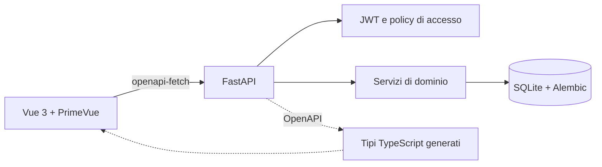
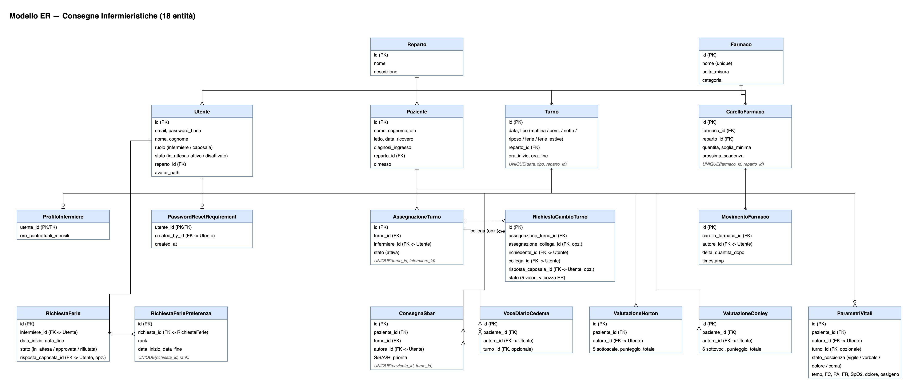

<p align="center">
  
</p>

<p align="center">
  <strong>Consegne infermieristiche strutturate, dal cambio turno alla cartella paziente.</strong>
</p>

<p align="center">
  
  
  
  
</p>

Eira è un'applicazione full-stack per la gestione digitale delle consegne
infermieristiche. Riunisce in un unico spazio operativo handover SBAR,
turnistica, dati clinici e coordinamento del personale, con percorsi distinti
per infermieri e caposala.

Il progetto è stato sviluppato come project work finale del Corso di Laurea in
Informatica per le Aziende Digitali dell'Università Telematica Pegaso. Il
contesto clinico rappresentato è fittizio e non esiste alcuna partnership con
strutture sanitarie reali.

> [!IMPORTANT]
> Eira è un progetto accademico e dimostrativo: non è un dispositivo medico e
> non deve essere usato per gestire dati o decisioni cliniche reali.

## Cosa permette di fare

| Area                                     | Infermiere | Caposala |
| ---------------------------------------- | :--------: | :------: |
| Dashboard e consultazione turni          |     ✓      |    ✓     |
| Cartella paziente e parametri vitali     |     ✓      |    ✓     |
| Consegne SBAR/ISBAR e diario CEDEMA      |     ✓      |    ✓     |
| Valutazioni Norton e Conley              |     ✓      |    ✓     |
| Richieste di cambio turno e ferie        |     ✓      |    ✓     |
| Carrello farmaci                         |     ✓      |    ✓     |
| Gestione turni, assegnazioni e personale |            |    ✓     |
| Approvazione cambi turno e ferie         |            |    ✓     |
| Banca ore                                |            |    ✓     |

Le principali funzionalità includono:

- handover strutturato con metodo **SBAR/ISBAR**, priorità e storico;
- cartella paziente con parametri vitali, diario CEDEMA e valutazioni del
  rischio Norton/Conley;
- pianificazione dei turni, assegnazioni e rilevamento dei turni scoperti;
- cambio turno con doppia conferma: collega e caposala;
- richieste ferie, banca ore e monitoraggio delle scorte farmaci;
- dashboard dedicate al ruolo e interfaccia responsive per desktop e tablet.

## Architettura



- **Frontend:** Vue 3, Vite, TypeScript, Pinia, PrimeVue e Vue Router.
- **Backend:** FastAPI, SQLAlchemy, Pydantic, JWT e Alembic.
- **Contratto API:** client `openapi-fetch` e tipi TypeScript generati dallo
  schema OpenAPI del backend.
- **Persistenza:** SQLite con migrazioni e bootstrap non distruttivo.
- **Autorizzazione:** controlli server-side per ruolo, reparto, utente e turno;
  i controlli del frontend hanno il solo scopo di guidare l'esperienza utente.

Per una descrizione più approfondita consulta le guide di
[architettura frontend](docs/FRONTEND-ARCHITECTURE.md) e
[architettura backend](docs/BACKEND-ARCHITECTURE.md).

## Avvio rapido

### Prerequisiti

- Python 3.12 e [`uv`](https://docs.astral.sh/uv/)
- Node.js 22 e npm 10+

### Installazione

```bash
git clone https://github.com/Zuboh/Eira.git
cd Eira

nvm use
cd backend && uv sync --locked
cd ../frontend && npm ci
cd ..
```

### Configurazione e avvio

```bash
cp backend/.env.example backend/.env
cp frontend/.env.example frontend/.env
./dev.sh
```

L'applicazione sarà disponibile su:

- frontend: <http://localhost:5173>
- documentazione API: <http://localhost:8000/docs>
- health check: <http://localhost:8000/health>

`dev.sh` prepara lo schema del database e avvia frontend e backend. Libera le
porte `5173` e `8000` se sono già occupate; per un avvio manuale o una
configurazione più controllata segui la [guida di setup](docs/SETUP.md).

## Accesso demo

In ambiente `development` il seed crea il reparto **Medicina Generale e
Geriatria** e due profili dimostrativi:

| Ruolo      | Profilo        | Password   |
| ---------- | -------------- | ---------- |
| Caposala   | Admin Caposala | `password` |
| Infermiere | Giulia Bianchi | `password` |

Dalla schermata di accesso seleziona il reparto, poi il profilo desiderato. Il
seed è disponibile solo in sviluppo ed E2E ed è sempre disabilitato in
produzione.

## Qualità e test

Il progetto include test di API e dominio, test di componenti e composable,
controlli statici, verifica del contratto OpenAPI ed E2E browser con controlli
di accessibilità axe-core.

```bash
# Backend
cd backend
PYTHONPATH=. uv run pytest
uv run ruff check .

# Frontend
cd ../frontend
npm run lint
npm run format:check
npm run test
npm run typecheck
npm run build
npm run openapi:check
npm run test:e2e
```

I test backend usano database in-memory isolati. Playwright avvia servizi su
porte dedicate e ricrea il proprio database E2E per ogni suite.

## Sicurezza

- password archiviate con bcrypt e policy condivisa;
- token JWT con scadenza e utente ricaricato dal database a ogni richiesta;
- isolamento dei dati tra reparti e controlli contro accessi IDOR;
- CORS configurabile e secret JWT obbligatorio in produzione;
- seed e credenziali note bloccati in produzione;
- validazione e normalizzazione server-side degli avatar.

Le decisioni, i limiti noti e il threat model sono documentati in
[SECURITY.md](docs/SECURITY.md).

## Documentazione

| Documento                                                 | Contenuto                                          |
| --------------------------------------------------------- | -------------------------------------------------- |
| [Indice della documentazione](docs/README.md)             | Percorso di lettura e fonti canoniche              |
| [Setup](docs/SETUP.md)                                    | Ambiente, database, migrazioni e comandi operativi |
| [Design system](docs/DESIGN.md)                           | Token, componenti e principi visuali               |
| [Glossario](docs/GLOSSARY.md)                             | Linguaggio clinico e di dominio usato nel progetto |
| [Data fetching](docs/FETCHING.md)                         | Convenzioni OpenAPI del frontend                   |
| [Scoring valutazioni](docs/domain/VALUTAZIONI-SCORING.md) | Regole Norton e Conley implementate                |
| [Flusso cambio turno](docs/domain/CAMBIO-TURNO-FLOW.md)   | Stati e transizioni del workflow                   |

## Modello dati

Il diagramma ER completo è disponibile anche nel formato sorgente
[draw.io](docs/diagrams/er-consegne-infermieristiche.drawio).


